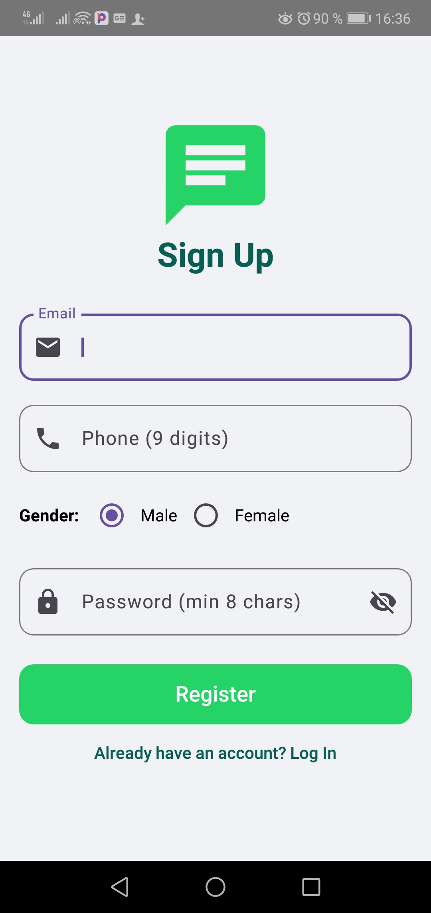
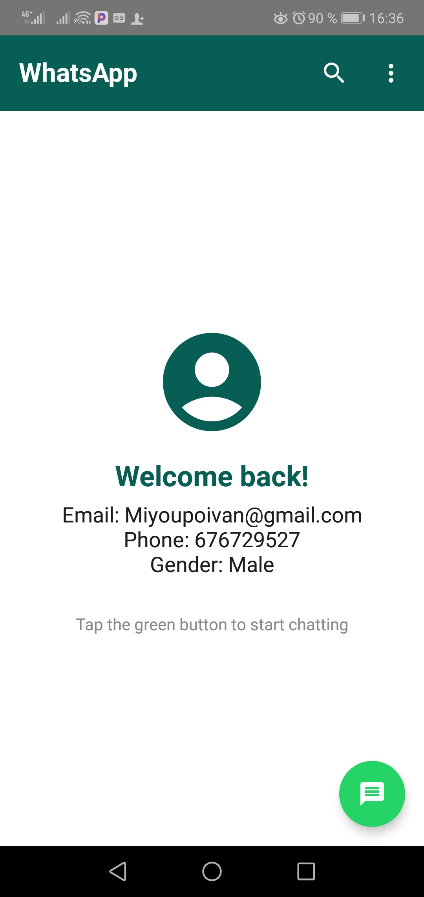
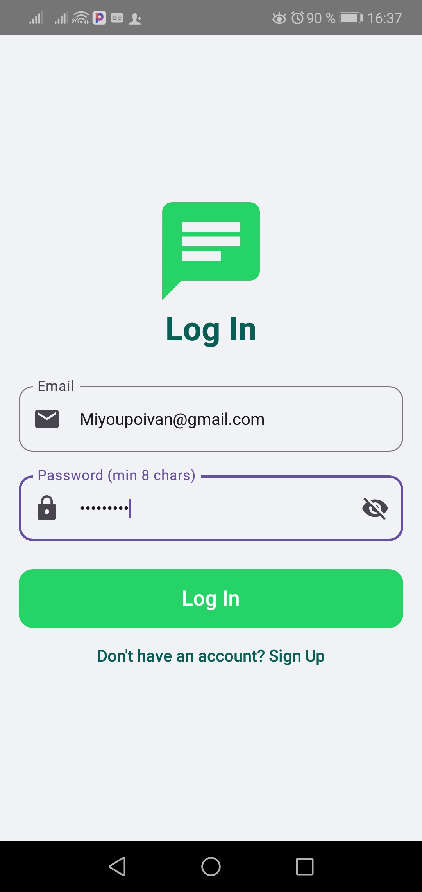

# WhatsApp Clone Android App

A fancy WhatsApp-themed Android application built with Jetpack Compose. This app features a complete authentication system with a custom UI and data exchange between activities.

## 📸 Screenshots

Here are the visual representations of the app's flow:

| Login / Sign Up | Form Interaction | Landing Page |
| :---: | :---: | :---: |
|  |  |  |

## 📱 Project Assets

| Asset Name | View |
| :--- | :--- |
| **App Icon** |  |
| **Round Icon** |  |

## ✨ Features

- **WhatsApp UI Design**: Authentic teal and green color palette mimicking the popular messaging app.
- **Authentication System**: 
  - Dual mode: Sign-in and Log-in.
  - Form validation with specific error messages:
    - **"enter the valid email"**: For incorrect email formats.
    - **"enter a valid password"**: For passwords shorter than 8 characters.
    - **"phone number must be 9 digits"**: For incorrect phone numbers.
- **Data Exchange**: Uses `Parcelable` to securely pass user data from the authentication screens to the landing page.
- **Landing Page**: A welcome screen with a WhatsApp-style header and layout.

## 🛠️ Built With

- **Jetpack Compose**: For a modern, declarative UI.
- **Kotlin**: The primary language for Android development.
- **Material 3**: For state-of-the-art UI components and icons.
- **Kotlin Parcelize**: For efficient object serialization between activities.

## 🚀 Getting Started

1. Clone this repository.
2. Open the project in Android Studio.
3. Sync Gradle and run the app.
